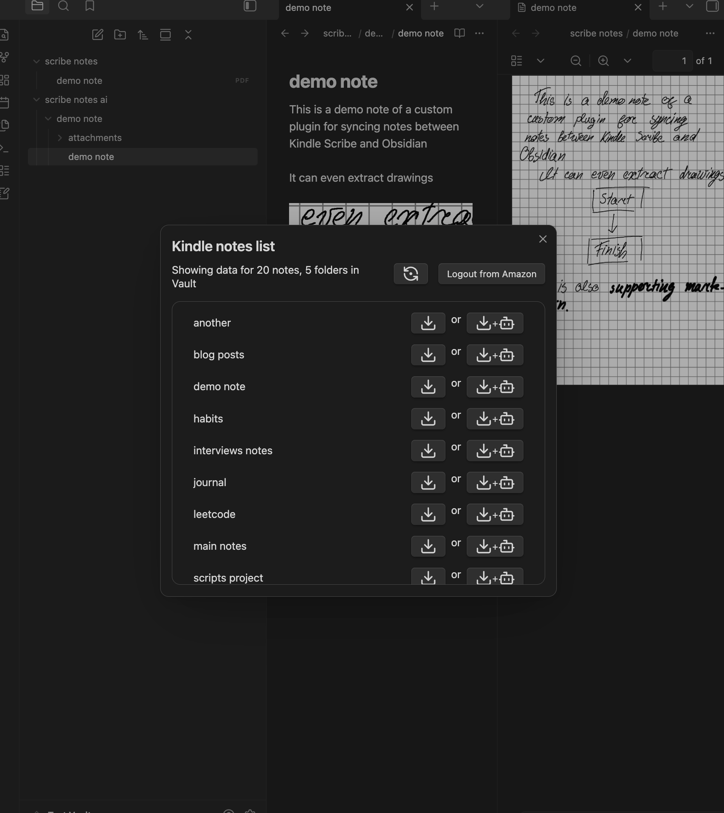

# Obsidian Kindle Scribe Notes Sync Plugin
## With OpenRouter support

Sync your Kindle Scribe notes to your Obsidian Vault.

> [!WARNING]  
> This plugin is in a rather early state. I honestly barely have time to develop it, so contributions are welcome.

Current functionality:
- [x] pulling notes from root folder 
- [x] pulling notes from subfolders
- [x] notes OCR
    - [x] first iteration will be just using OpenRouter API
- [x] separate out OCR and download flow

Roadmap:
- [ ] autocheck notes hashes

# Instructions

> [!NOTE]
> This plugin is only available on Desktop. This plugin is using unofficial Amazon API and might break. For notes processing - an OpenRouter key is needed. (But downloading of notes in pdf is **available without a key**.)

## Currently, plugin is only availble via [BRAT plugin](https://tfthacker.com/BRAT).

## To Download notes:
1. Install this(Kindle Scribe Notes plugin) via BRAT into your obsidian.
1. Click notepad icon on the left
1. Login via modal and see your notebooks list

## To Process notes via AI models:
1. Install plugin
1. Go to obsidian settings(cog in bottom left of screen)
1. Select Kindle Scribe Notes Sync from plugins list
1. Insert your openrouter api key `it is something like "sk-or-v1..."`
1. Open the modal and see button to Download+Process notes enabled
1. Send your notes processing

### Some information regarding OpenRouter/downloads

Bigger notebooks might take a while to download and process. Current iteration finally includes a progress bar.

I have tested multiple models and `google/gemini-3.1-flash-lite-preview` seems to be the best one at the moment in terms of price-performance. It is super cheap. There is a way of changing models in case you want to try out some other models.

Downloads are done sequentially, in an attempt not to get Amazon suspicios. This is using APIs that are under the hood of notebook preview in their apps/web.

## License

[MIT](LICENSE)

[1]: https://obsidian.md
[2]: https://mozilla.github.io/nunjucks
[3]: https://github.com/pjeby/hot-reload
[4]: https://read.amazon.com/notebook
[5]: https://github.com/hadynz/obsidian-kindle-plugin